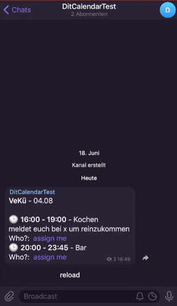

# caldav-telegram-bot 
TODO

you can post it in your telegram group/channel, so a person can assign hirself

# how to use
TODO
### how to update
After this program is deployed to heroku **it will not be updated automatically!** If you are interested in more features, you should check out [new releases](https://github.com/dit-calendar/caldav-telegram-bot/releases) from time to time.

To update your bot manually, you have to delete the program in heroku (under settings) and click on the heroku deploy button from step 3. again. Unfortunately this will cause data loss at the moment (but only usernames). To avoid problems you have to click on the reload button in your telegram group of each still relevant calendar or repost them again.

# for developers

## local execution
* nextcloud:
  * `docker run --name nextcloud_caldav -p 8080:80 nextcloud` on first start
    * `docker start container-id` to run existing nextcloud server
* start bots DB with `docker-compose up`

## manual deployment
* `gradle build`
* `heroku deploy:jar build/libs/caldav-telegram-bot*-all.jar --app caldav-telegram-bot`

## manual test
* https://core.telegram.org/bots/webhooks
* check bot status `https://api.telegram.org/bot{token}/getWebhookInfo`
* send message manually
 `curl -v -k -X POST -H "Content-Type: application/json" -H "Cache-Control: no-cache"  -d '{
 "update_id":10000,
 "message":{
   "date":1441645532,
   "chat":{
      "last_name":"Test Lastname",
      "id":1111111,
      "first_name":"Test",
      "username":"Test"
   },
   "message_id":1365,
   "from":{
      "last_name":"Test Lastname",
      "id":1111111,
      "first_name":"Test",
      "username":"Test"
   },
   "text":"/start"
 }
 }' "localhost:8443/"`
