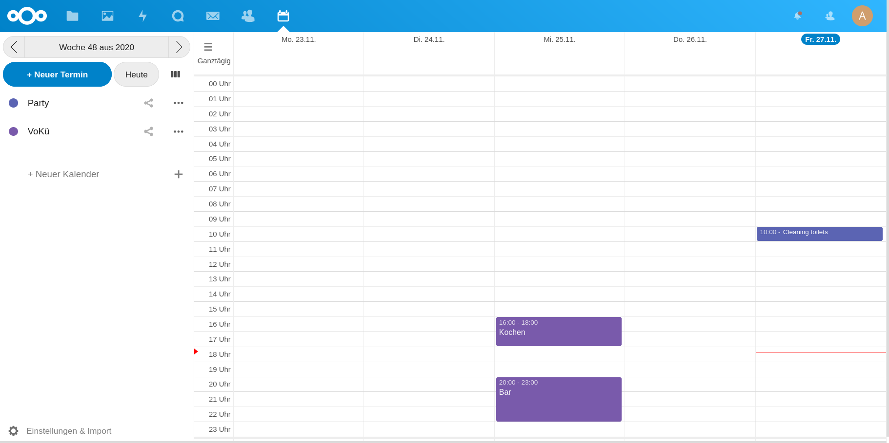

# caldav-telegram-bot 
This is a tool to allow user-event assignment via telegram for any CalDAV calendar (e.g. nextcloud, google calendar, outlook, [etc.](https://en.wikipedia.org/wiki/CalDAV#Server)). It designed to help (public/collective/participatory/collaborative) groups with self-administration of work.

> :octocat: Alternatively,  [other calendars](https://github.com/dit-calendar/dit-calendar.github.io) are also supported.

after you created an event or task in your calendar

you can post it in your telegram group/channel, so a person can assign hirself

# how to use
To use this application in your telegram group, you must first complete following steps:
1. open your calendar and find the CalDAV addresse
   * the url should look like https://www.xxx.xxx/dav and ends with `/dav`. probably found in the calendar settings/imports.
2. create a telegram Bot
   * start a conversation with [@Botfather](https://t.me/botfather) and write `/newbot`
   * give your Bot a name, maybe a nice picture and **please mention this website in your Bot description**
3. start the program for your telegram Bot by clicking on
     _(you need an account but it's free)_
   * it will build&start the program from the current source code
4. invite the new Bot to a telegram group/channel and post `/postcalendar CalendarName Date` e.g. `/postcalendar VoKü 2020-11-25`

**This application is in beta** and will be further developed after some [feedback](https://github.com/dit-calendar/caldav-telegram-bot/issues) from you.

### how to update
After this program is deployed to heroku **it will not be updated automatically!** If you are interested in more features, you should check out [new releases](https://github.com/dit-calendar/caldav-telegram-bot/releases) from time to time.

To update your bot manually, you have to delete the program in heroku (under settings) and click on the heroku deploy button from step 3. again. Unfortunately this will cause data loss at the moment (but only usernames). To avoid problems you have to click on the reload button in your telegram group of each still relevant calendar or repost them again.

# for developers

## local execution
* nextcloud:
  * `docker run --name nextcloud_caldav -p 8080:80 nextcloud` on first start
    * `docker start container-id` to run existing nextcloud server
* start bots DB with `docker-compose up`

## manual deployment
* `gradle build`
* `heroku deploy:jar build/libs/caldav-telegram-bot*-all.jar --app caldav-telegram-bot`

## manual test
* https://core.telegram.org/bots/webhooks
* check bot status `https://api.telegram.org/bot{token}/getWebhookInfo`
* send message manually
 `curl -v -k -X POST -H "Content-Type: application/json" -H "Cache-Control: no-cache"  -d '{
 "update_id":10000,
 "message":{
   "date":1441645532,
   "chat":{
      "last_name":"Test Lastname",
      "id":1111111,
      "first_name":"Test",
      "username":"Test"
   },
   "message_id":1365,
   "from":{
      "last_name":"Test Lastname",
      "id":1111111,
      "first_name":"Test",
      "username":"Test"
   },
   "text":"/start"
 }
 }' "localhost:8443/"`
